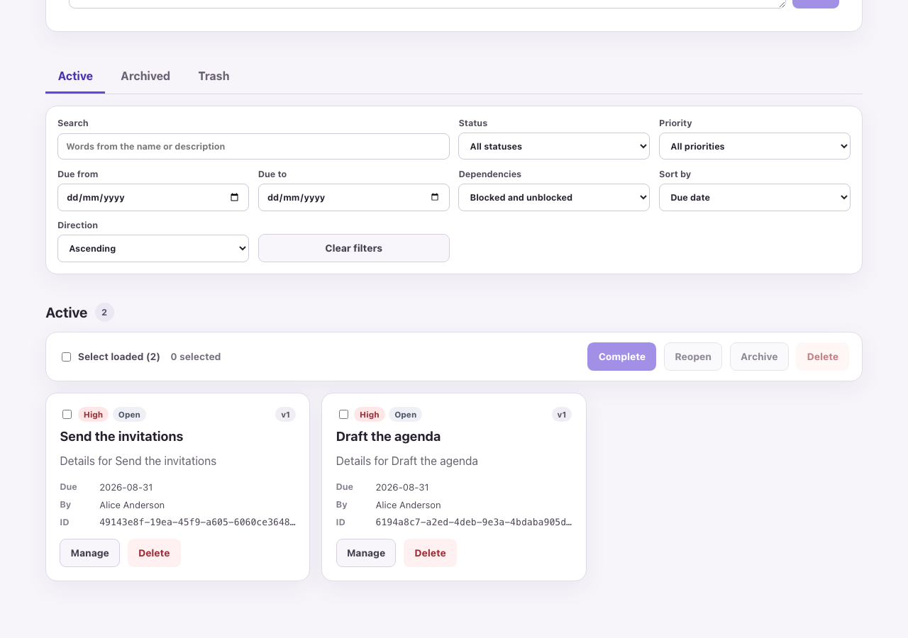
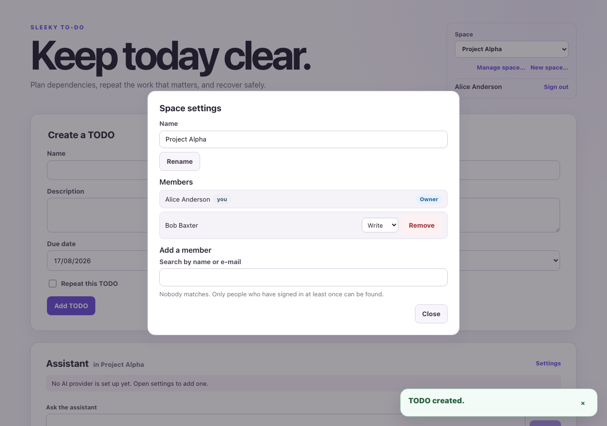
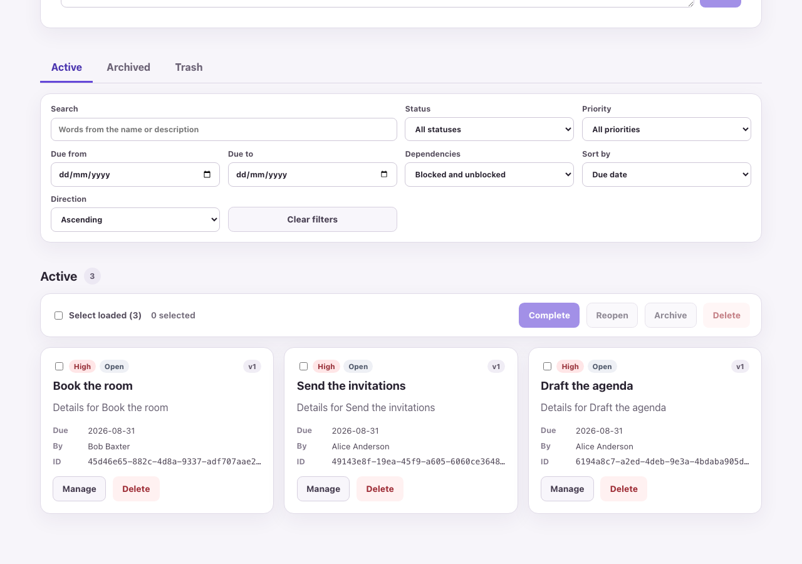
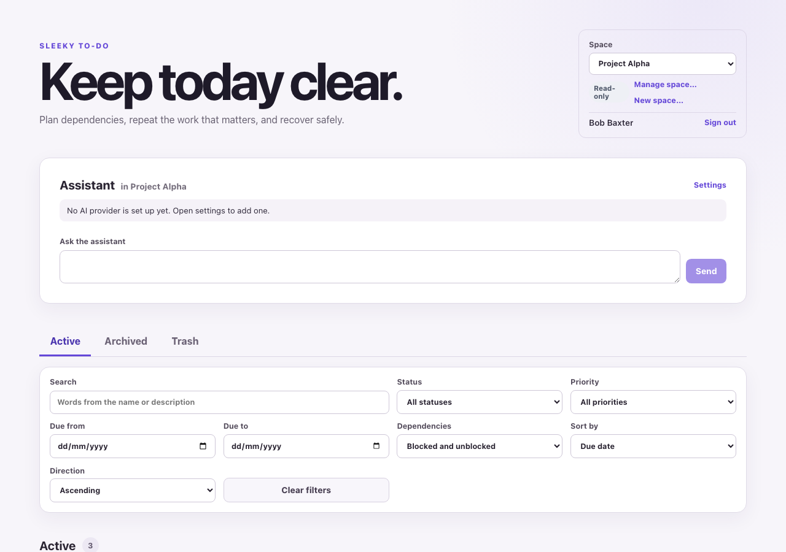
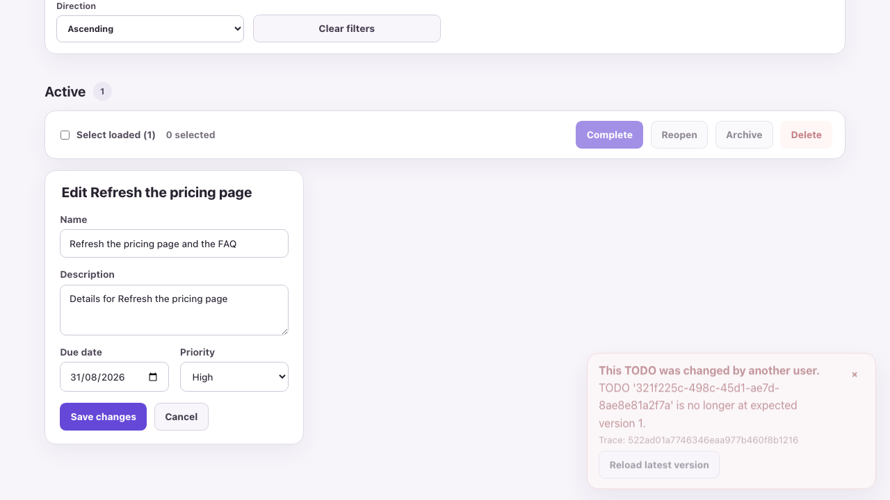
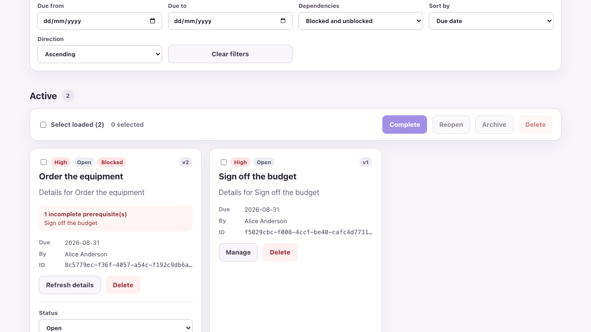
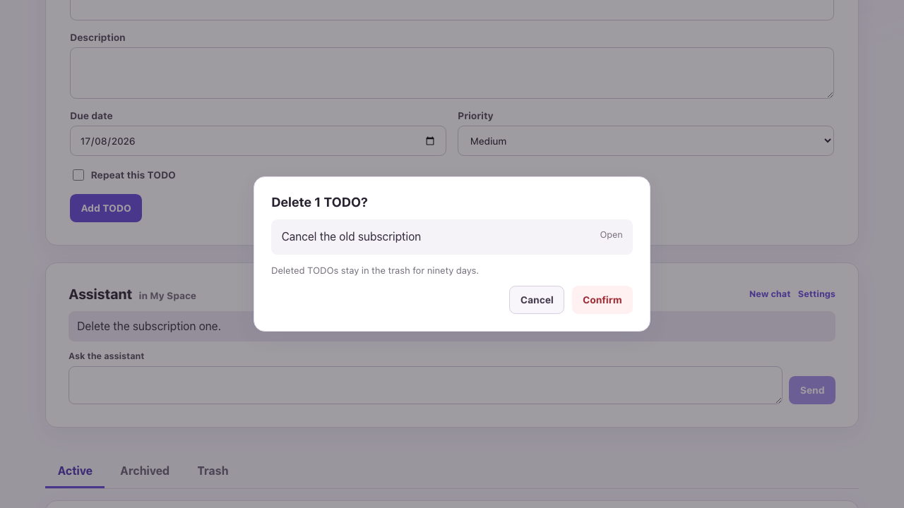

# Sleeky To-Do

A layered-monolith TODO application: ASP.NET Core and MediatR over MongoDB,
with a React and TypeScript client. TODOs live in **Spaces**: shared lists
whose membership decides who may read them and who may write to them. The
whole slice — domain rules, persistence, HTTP API, and UI — is implemented and
tested end to end.

## Sharing a list, end to end

Alice owns a Space and fills it. She shares it with Bob as **Write**, and he
reaches it from his own selector — nothing is pushed to him, so his list shows
Alice's work the next time he asks for the page. When she narrows him to
**Read**, the badge appears and every control that would change something is
gone; the server refuses the write regardless of what the page offers.

| | |
|---|---|
|  |  |
| Her list, in a Space she made. | Bob added, at the level she chose. |
|  |  |
| The same list from his side, with his TODO in it. | After the downgrade: read-only, and no way in. |

These are captured from the running application by the same helpers the
browser suite drives it with, so they show the product rather than a mock-up.
`corepack yarn screenshots` regenerates them.

## Features

- **Shared lists.** A Space is a named list with its own access list. Everyone
  gets a personal Space on first sign-in; any Space can be shared with a
  colleague as Read, Write, or Owner, and the level can be changed or revoked.
  A Space you are not in answers `404`, so an identifier is never confirmed; an
  action above your level answers `403`. Every route under a Space is
  authorized by the request pipeline, so no handler can forget to check.
- **CRUD with optimistic concurrency.** Create, read, update, and delete with
  validation, across four statuses — Open, In progress, Completed, and
  Archived. Every write carries the version last read; a stale save is
  rejected with `409` and the client offers to reload rather than overwrite
  silently.
- **List queries.** Filter by status, priority, due-date range, and dependency
  state (Blocked/Unblocked); word-prefix search across name and description;
  `Active`, `Archived`, and `Deleted` scopes; sorting by due date, priority,
  status, or name, ascending or descending; deterministic cursor pagination.
  Filtering, sorting, and paging all run in MongoDB against Space-leading
  indexes and projections — the collection is never loaded or counted in the
  browser — so a Space of 10,000+ TODOs pages as cheaply as a small one.
- **Dependencies and blocking.** A TODO can depend on others. Direct and
  transitive cycles are rejected, and a TODO whose prerequisites are incomplete,
  deleted, or archived is blocked from moving to In progress or Completed.
- **Recurrence.** Daily, weekly, monthly, and custom day/week/month intervals,
  with monthly anchor preservation. Completing a recurring TODO creates the
  next occurrence in the same MongoDB transaction — never zero, never two.
- **Recoverable deletion.** Delete moves a TODO to Trash with a 90-day restore
  window; a TODO that an active dependent still needs cannot be deleted.
- **Bulk actions.** Status changes, restores, and deletes over a selection,
  all-or-nothing, mirroring the single-item routes.
- **Authentication.** OpenID Connect login and an encrypted HttpOnly cookie
  session; the browser never holds an access, ID, or refresh token.
- **AI assistant.** Natural-language bulk actions over the same commands the
  toolbar uses, streamed as server-sent events, with confirmation before
  anything destructive. It works in whichever Space is open, and is told so:
  a read-only member's writes come back refused. Bring your own key —
  Anthropic or any OpenAI-compatible endpoint — or use one configured for the
  deployment.

Three of those rules, caught in the act:

| | | |
|---|---|---|
|  |  |  |
| A save made against a version someone else had already moved past. The edit is kept; reloading is offered rather than chosen. | A prerequisite that is not finished, and a dependent that cannot start until it is. | The assistant proposes a deletion. Nothing is removed until it is confirmed. |

Deliberately not built, with reasons in
[docs/decision-log.md §3](docs/decision-log.md#3-what-was-deliberately-not-built):
user registration, real-time push (a colleague's change appears on your next
load), deleting or leaving a Space, moving a TODO between Spaces, invitations,
groups, the physical purge job, provider-initiated logout, and server-side
assistant history.

## Prerequisites & quick start

- .NET SDK 10.0.302
- Node.js 24.19.0 with Corepack (Yarn 4.18.0)
- Docker with Docker Compose

Three terminals.

**1. Start MongoDB and Keycloak**, and wait for both to report healthy:

```sh
docker compose up -d
docker compose ps
```

**2. Run the API.** The first run on a machine may need
`dotnet dev-certs https --trust`.

```sh
dotnet run --project src/Sleeky.Todo.Api --launch-profile https
```

**3. Run the React client:**

```sh
cd src/sleeky-todo-web && corepack yarn install && corepack yarn dev
```

Open `http://localhost:5173` and sign in as `alice` / `alice-password`.

### User journey

Two browsers: a normal window for `alice` and a private one for `bob`. Every
step below is an ordinary feature; nothing exists only for this walkthrough.

1. **Alice signs in.** The selector at the top of the list shows **My Space**,
   created for her automatically. **New space…** → `Project Alpha`; the URL
   becomes `/spaces/{id}` and the list is empty.
2. **Create TODO A**, then **TODO B**. On B, **Manage** → *Prerequisites* →
   search for A, pick it, **Add**. B now carries a **Blocked** badge, and in
   its status selector *In progress* and *Completed* are disabled. (The API
   refuses the same transition with `409` if it is sent anyway, for instance
   from Swagger. Adding A → B as well is rejected as a cycle.)
3. **Complete A.** The list refreshes; B's badge is gone and it can start.
4. **Recurrence.** Create a TODO with *Repeat this TODO* enabled and complete
   it; the next occurrence appears, in the same MongoDB transaction as the
   completion.
5. **Bob signs in once** in the private window and stays signed in. Only
   people who have signed in are in the user directory — there are no
   invitation e-mails.
6. **Share with Bob.** As Alice: **Manage space…** → *Add a member* → `bob` →
   **Write** → add. Bob reloads and picks `Project Alpha` in his selector: he
   sees Alice's TODOs and can edit them and add his own.
7. **Concurrent edit.** Both open **Manage** on the same TODO and both save.
   The first save wins; the second reports a stale version (`409`) and offers
   **Reload latest version** rather than overwriting. Concurrency is per TODO,
   so edits to different TODOs in the same Space never collide.
8. **Downgrade Bob to Read.** After his next reload the list is marked
   *Read-only* and every editing control is gone; a write he had already
   started answers `403`.
9. **Remove Bob.** `Project Alpha` disappears from his selector and answers
   `404` on every route.
10. **Trash.** Delete a TODO, open the **Trash** tab, restore it.
11. **Blocked/Unblocked filter.** In the filter panel set *Dependencies* to
    **Blocked** or **Unblocked**; combine it with status, priority, due-date
    range, search and any sort field.
12. **Assistant** (optional; configure a model in the next section). Ask the
    panel to, say, complete everything due this week. Destructive actions
    come back as a proposal to confirm first, and a Read member's writes are
    refused.
13. **API and CI.** Swagger UI at `https://localhost:7238/swagger`; the
    [GitHub Actions workflow](.github/workflows/ci.yml) runs formatting, build,
    the .NET suites with coverage thresholds, the client lint/unit/build, the
    browser suite against Keycloak, and a Docker image smoke test.

### AI assistant with a local model

The assistant needs a chat model. The way to try it without an API key is
[Ollama](https://ollama.com) on the host: pull a model that supports tool
calling, then point the assistant at Ollama's OpenAI-compatible endpoint.
Development already allows loopback endpoints
(`Assistant:AllowPrivateEndpoints`), which the default configuration refuses.

```sh
ollama pull llama3.2
```

In the app, open **Settings** in the Assistant panel and enter:

| Field    | Value                       |
| -------- | --------------------------- |
| Provider | OpenAI-compatible           |
| Model    | `llama3.2`                  |
| Base URL | `http://localhost:11434/v1` |
| API key  | anything, e.g. `ollama`     |

**Test** probes the endpoint without saving; **Save** stores the configuration
for that user, with the key encrypted. The key field is required because a
hosted endpoint needs one; Ollama ignores it.

To give every user the same provider without touching the form, set it at the
application level instead:

```sh
Assistant__Provider=OpenAiCompatible Assistant__BaseUrl=http://localhost:11434/v1 Assistant__Model=llama3.2 Assistant__ApiKey=ollama dotnet run --project src/Sleeky.Todo.Api --launch-profile https
```

An Anthropic key works the same way — provider `Anthropic`, no base URL —
and the default model is `claude-sonnet-5`.

## MongoDB

`docker compose up -d` starts a single-node replica set (`rs0`), which the
recurring-completion transaction needs, and an idempotent initializer, so
repeated `up` is safe. The API reads the `MongoDb` configuration section; the
committed default is `mongodb://localhost:27017/?replicaSet=rs0`, database
`sleekyTodo`. Override any value through environment variables:

```sh
MongoDb__ConnectionString="mongodb://host:27017/?replicaSet=rs0" dotnet run --project src/Sleeky.Todo.Api
```

Indexes are created at startup. `docker compose down` keeps the data volume;
`docker compose down --volumes` discards it, which is also the fix for a local
database written by an older, incompatible schema.

## Authentication

Login is OpenID Connect; the application session is an encrypted HttpOnly
cookie, so the browser never holds an access, ID, or refresh token. Compose
starts a Keycloak realm at `http://localhost:8080` with two seeded users:

| Username | Password         |
| -------- | ---------------- |
| `alice`  | `alice-password` |
| `bob`    | `bob-password`   |

`appsettings.Development.json` already points at that realm. Elsewhere, set
the provider and client and keep the secret out of source control:

```sh
dotnet user-secrets set "Authentication:ClientSecret" "secret-value" --project src/Sleeky.Todo.Api
```

Unauthenticated API requests answer `401` rather than redirecting. Mutations
also need an antiforgery token in the `X-CSRF-TOKEN` header, issued by
`GET /api/auth/antiforgery`. Sign-out ends the provider's session too, so the
next sign-in prompts for credentials again.

## API

Swagger UI documents every route and is served in Development at
`https://localhost:7238/swagger` (OpenAPI document at
`/swagger/v1/swagger.json`). TODO routes are nested under their Space —
`/api/spaces/{spaceId}/todos/...` — and Spaces themselves live at
`/api/spaces`. Failures use RFC Problem Details: `400` validation, `403`
insufficient permission in a Space, `404` not found or not a member, `409`
stale version or domain-rule conflict. `GET /health` reports whether MongoDB
answers a ping.

## Tests

804 tests in three layers, each answering a different question.

- **708 .NET tests.** Domain rules with nothing running (90), application
  handlers against substitutes (241), the assistant's tool and turn layer
  (154), and 223 integration tests against a real MongoDB — repository and
  list-reader contracts, and the HTTP API end to end. The database is started
  per test class by Testcontainers, as a replica set where a transaction is
  under test.
- **39 client unit tests** over the logic worth isolating: which Space a URL
  resolves to, how a page of TODOs merges with the one before it, how a status
  code becomes a message.
- **57 browser tests** driving Chromium through a real Keycloak login against
  the real API, two of them with two signed-in people at once.

The claims that are easy to make and hard to hold are each pinned by a named
test:

| Behaviour | Where it is proven |
|---|---|
| A Write member gets the Space and everything in it | `SpaceSharingApiTests.AWriteGrantGivesTheNewMemberTheSpaceAndItsTodos` |
| A downgrade to Read leaves the list visible and untouchable | `SpaceSharingApiTests.ADowngradeToReadLeavesTheSpaceVisibleAndTheTodosUntouchable` |
| Removal takes the Space and everything under it | `SpaceSharingApiTests.ARemovedMemberLosesTheSpaceAndEverythingUnderIt` |
| A non-member reaches none of a Space's TODOs | `TodoApiTests.ANonMemberCannotReadOrListASpacesTodos` |
| Two writers at one version: one wins, one is told | `TodoApiTests.ConcurrentWritesWithSameVersionReturnOneSuccessAndOneConflict` |
| A completed recurring TODO leaves exactly one successor | `TodoApiTests.CompletingRecurringTodoCreatesExactlyOneNextOccurrence` |
| …and none at all if the successor cannot be written | `TodoApiTests.FailedNextOccurrenceInsertionRollsBackCompletion` |
| A blocked TODO answers `409` to In progress/Completed, and the Blocked/Unblocked filter tracks it, until its prerequisite completes | `TodoApiTests.BlockedStatusTransitionsSucceedAfterPrerequisiteCompletes` |
| Direct and transitive dependency cycles are rejected | `TodoApiTests.DirectAndMultiLevelDependencyCyclesAreRejected` |
| A prerequisite still in use cannot be deleted, and a stale version is rejected | `TodoApiTests.ActivePrerequisiteCannotBeDeletedAndMutationsRejectStaleVersions` |
| The assistant refuses a Space you cannot see, before the model | `AssistantTurnApiTests.ATurnInASpaceTheUserCannotSeeIsRefusedBeforeTheModel` |
| Two people on one list, at the level the owner set | `e2e/sharing.spec.ts` |
| A Space switch changes which TODOs exist, and survives reload | `e2e/spaces.spec.ts` |

Domain and application suites need nothing running:

```sh
dotnet test
```

Repository and API integration tests start their own MongoDB container and are
opt-in; without the variable they are skipped and still report "Passed":

```sh
RUN_MONGODB_INTEGRATION_TESTS=true dotnet test tests/Sleeky.Todo.IntegrationTests
```

Browser tests drive the real Keycloak login, so `docker compose up -d` must be
running:

```sh
cd src/sleeky-todo-web && corepack yarn playwright install chromium && corepack yarn test:e2e
```

## Deployment

One image serves the client and the API from a single origin:

```sh
docker build --tag sleeky-todo .
```

Three settings decide whether a deployment works — registering the origin with
the identity provider, trusting forwarded headers, and persisting the
data-protection key ring. They are covered in
[docs/deployment.md](docs/deployment.md).

## Further reading

- [docs/architecture.md](docs/architecture.md) — component diagram, request
  flow, and each boundary the code holds: persistence, concurrency, the
  recurring-completion transaction, authentication, the Space boundary, the
  assistant, logging
- [docs/decision-log.md](docs/decision-log.md) — two pages: how the ambiguous
  requirements were read, the key trade-offs, what was deliberately not built,
  and what more time would change
- [docs/decision-log-detailed.md](docs/decision-log-detailed.md) — every
  decision as it was made, with the alternatives that were rejected
- [docs/coding-standards.md](docs/coding-standards.md) — the conventions the
  code follows
