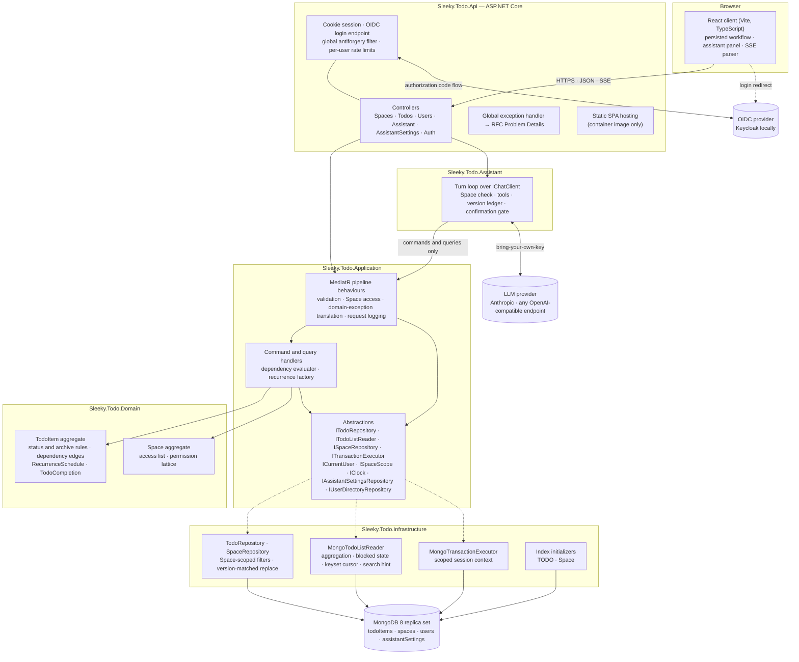
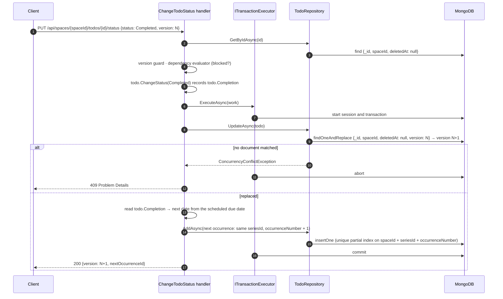

# Architecture

The application is a layered monolith. Solid arrows are calls; dashed arrows
are "implements" or an out-of-process redirect. Every arrow between the boxes
points inward, towards Domain.



The Application layer owns persistence and time abstractions. Infrastructure supplies their runtime implementations, keeping command handlers testable and independent of MongoDB and the system clock.

The Assistant is a fifth project sitting beside the API rather than beneath it. It sends the same commands and queries a controller does, so it enters the stack at the same point and inherits everything below. Every provider SDK dependency stops there, which is what keeps Application and API free of them.

## React client and persisted workflow

The React client uses a typed API module for its requests: the Space list,
detail, creation, and access changes; list, detail, create, update, status,
dependency, delete, and restore for a single TODO; the bulk status, delete, and
restore batches and the selection lookup that repairs them; the user search that
finds someone to share with; the session, login, logout, and antiforgery calls;
and the assistant's turn stream and provider settings. It parses Problem Details
in one place and distinguishes validation, permission, domain-rule, concurrency,
not-found, network, and unexpected failures. `403` is kept apart from `401`:
only the latter ends the session, because being refused one action is not being
signed out. Serilog and backend implementation types do not cross the HTTP
boundary.

The active Space lives in the URL, at `/spaces/:spaceId`, so a shared link opens
the list it names and a reload keeps it; local storage only remembers where the
user was last, for a visit to `/`. A pure `resolveActiveSpace` decides where a
visit lands — the requested Space if it is reachable, then the remembered one,
then the oldest, which is the personal Space the server ensures on every listing
— and the client navigates only to what it returns, so an inaccessible
identifier redirects instead of rendering an error. The page body is rendered
keyed by the Space identifier, so switching remounts it and every piece of list
state — filters, cursor, items, selection, open editors — is gone by
construction rather than by hand. A member holding only `Read` is shown the list
without the controls that would be refused. A Space-scoped `404` mid-session
means access was withdrawn: the client re-reads its Space list and, if the
active one has gone, returns to `/` with a notice.

The main screen is backed by `GET /api/spaces/{spaceId}/todos`; it does not
keep a browser-only TODO collection. Active, Archived, and Trash tabs select
the matching server scope. Changing scope, filters, sort field, or direction
starts a new first-page request without a cursor and replaces the displayed
items. Load More sends the
opaque `nextCursor` and appends the returned page.

List responses remain projections. Full TODO details are loaded only when the
user opens management controls or when a blocked card needs prerequisite names.
Each mutation of an existing TODO uses the version from the latest loaded
representation and then refreshes the persisted list. A concurrency response is
never overwritten silently: the UI displays the conflict and Reload Latest
Version replaces stale state from the server.

The assistant panel sits beside the list and refreshes it through the same
callback the bulk toolbar uses, because its writes are the same writes. Turn
events are read off the `fetch` body by a small parser beside the API module;
the transcript it holds is opaque to the client, which only carries it back.

The filter panel leads with a search box. Its own state holds what is typed;
only the debounced value is merged into the filters the list reads, so a
keystroke cannot invalidate a cursor the Load More button is still holding. The
merge returns the existing filters object when the value has not changed, which
is what stops the mount and the Clear reset from each firing a second identical
request. Load More is hidden while a first page is in flight, because the cursor
still on screen belongs to the page being replaced.

Dependency selection is no longer bounded by what the client has loaded. The
picker sends the typed text to the same list endpoint the page uses, scoped to
active TODOs and sorted by normalized name, and the server matches it. Only the
two predicates the server cannot know stay in the client: the card excludes
itself and the prerequisites it already has. A selection that stops being
offered as the list narrows is cleared, so Add cannot send an identifier the
picker no longer shows. While a fetch is in flight the previous options remain
visible and selectable and the group is marked busy, rather than flickering
empty on every pause in typing.

The match is by token prefix rather than by substring, so a word has to be
typed from its start. That is the deliberate cost of making the match
index-backed; see the decision log.

## Authentication and session boundary

This section records the boundary the authentication slice holds, because the
Space, transport, and test decisions all rest on it.

Login uses OpenID Connect, and the application session is an ASP.NET Core
encrypted cookie. The React client never receives or stores an access, ID, or
refresh token:

```text
React /login
  -> GET /api/auth/login
  -> OIDC provider
  -> /signin-oidc
  -> resolve or create the internal user
  -> encrypted HttpOnly session cookie
  -> redirect to a validated local return URL
```

The cookie handler is both the default authentication scheme and the default
challenge scheme; OpenID Connect is challenged explicitly and only by
`GET /api/auth/login`. The challenge scheme decides what an unauthenticated API
request receives, so this is a functional choice rather than a stylistic one.
With OpenID Connect as the default challenge, a client `fetch` would be answered
with a redirect to the provider instead of a status code. The cookie handler's
redirect events are therefore replaced so API requests receive `401` and `403`
directly, and the client treats `401` as "start the login flow" rather than
following a cross-origin redirect it cannot complete.

The session cookie carries a minimal encrypted ticket: the internal user ID, a
display name, authentication metadata, and the ID token. The ID token is kept
for exactly one purpose — provider sign-out has to present it as an
`id_token_hint` — and it is stored on its own rather than by turning on
`SaveTokens`, which would add the access and refresh tokens the application
never calls a provider API with. No token reaches the browser or any
client-readable storage: the ticket is encrypted and its cookie is HttpOnly.

### Development callback routing

The OpenID Connect handler derives its `redirect_uri` from the incoming request,
and its correlation cookie is written for the origin the browser is using. In
development the browser runs on the Vite origin while the API listens on its own
HTTPS port, so the callback paths must be proxied alongside `/api` and `/health`
and the API must observe the client host rather than its own. Without both, the
provider returns the browser to the API origin, where the correlation cookie
does not exist and the post-login redirect lands outside the client application.

### Antiforgery

A cookie-authenticated API is exposed to cross-site request forgery, so
state-changing requests carry an antiforgery token in a request header.
Validation is registered as a global filter rather than per endpoint: leaving a
mutation unprotected should require a deliberate opt-out instead of a remembered
opt-in.

Antiforgery tokens are bound to the authenticated identity, so a token issued
before login fails validation after it. The client therefore requests a token
whenever a session is established — on startup and when the login navigation
returns — and discards the one it holds when the session ends. The antiforgery
cookie may be readable by JavaScript; the session cookie remains HttpOnly and
is the only authentication credential.

### Logout

Logout ends the provider session along with the application session, so a
signed-out browser is asked for credentials again instead of being carried
straight back in on a single sign-on session that outlived the application.

```text
POST /api/auth/logout   (form post, antiforgery token in the form field)
  -> delete the application session cookie
  -> redirect to the provider's end-session endpoint
       id_token_hint from the ticket
       post_logout_redirect_uri = /signout-callback-oidc
       state carrying the final destination
  -> provider ends its own session
  -> /signout-callback-oidc
  -> redirect to /login
```

Reaching the end-session endpoint means handing the browser a redirect, and a
`fetch` cannot follow one — it resolves on an opaque response with the browser
still sitting on the application. Logout is therefore submitted as a real form
so the browser owns the navigation.

It stays a `POST` so the global antiforgery filter still covers it. Validation
reads the form field before the header whenever a request has a form content
type, which is the one way a browser-owned post can carry the token; a `GET`
would have been simpler and would have left forced sign-out open to any
cross-site navigation.

Two things have to permit the round trip. `SignedOutCallbackPath` is proxied
alongside the login callback in development, which it already was. And the
content security policy names the provider's origin in `form-action` beside
`'self'`, because browsers check that directive against the redirects a
submission follows rather than only against where the form was aimed. Under
`'self'` alone the post is blocked at the redirect — the worst failure
available here, because the application session ends, the browser lands on the
login page, and only the provider session is left standing.

A navigation cannot surface a failure the way a `fetch` can — a rejected token
answers with a bare `400` page rather than an error the client can act on — so
the client checks `/api/auth/me` and takes a fresh antiforgery token
immediately before submitting, and clears its own state instead when there is
no server session left to end.

Two degradations are deliberate. A deployment with no configured `Authority`
registers no OpenID Connect scheme; logout there deletes the cookie and
redirects to `/login` directly, which is also the path the integration test
host takes because it replaces authentication wholesale. And an application
session outliving the provider's — eight sliding hours against the provider's
own idle limit — still lands on `/login`, because an expired `id_token_hint` or
an already-dead single sign-on session makes the end-session endpoint a
redirect back rather than an error.

## Space boundary

A **Space** is the collaboration and authorization boundary: a named collection
of TODOs with an embedded access list, where each entry is a subject, a subject
type, and a permission from the lattice `Read < Write < Owner`. Membership of a
Space decides what a signed-in user may do to everything inside it. Every user
gets one Space of their own — "My Space", created on their first listing —
and it is an ordinary Space, renameable and shareable like any other.

Every TODO carries two identifiers. `SpaceId` names the Space that contains it
and is the only one authorization consults. `CreatedByUserId` records who wrote
it, so a shared list can show "created by Bob", and is never read by a filter or
a rule; it is audit data.

The two aggregates are also two concurrency boundaries. `Space.Version` covers
the Space's own state — its name and access list — and is matched on a rename
or membership change exactly as `Todo.Version` is matched on a TODO write. A
TODO write never touches the Space document, so members editing different TODOs
never contend, and only two Owners editing the same access list at once are
settled by the Space's version. TODOs are separate documents rather than an
embedded array for the same reason: an embedded list would grow the Space
without bound and make every unrelated TODO write contend on one document.

```text
Keycloak
  -> authenticated user (ICurrentUser)
  -> SpaceAccessBehavior          404 for a non-member · 403 below the level
                                  binds ISpaceScope for the rest of the request
  -> Space CQRS   ·   Todo CQRS   <- assistant tools, the same commands,
                                     with the Space taken from the turn
  -> TodoRepository / MongoTodoListReader     filter: spaceId == bound Space
  -> MongoDB
```

Access is decided in the request pipeline, and the answer is then carried
ambiently rather than passed along. A request that implements
`ISpaceScopedRequest` declares the Space it acts in and the permission it needs.
`SpaceAccessBehavior` runs after validation, resolves the caller's entry through
`ISpaceAccessService`, and either refuses or binds a request-scoped
`ISpaceScope` holding the Space's identifier, its name, and the level the caller
holds. Handlers contain no access checks at all.

Infrastructure reads that scope exactly the way it reads the current user.
`TodoRepository` and `MongoTodoListReader` apply `spaceId ==` inside their
shared identifier, mutation, and list filters, so reads, existence checks, batch
loads, dependency lookups, graph traversal, active-dependent checks, mutations,
and cursor pages are scoped by construction, and no repository or reader
signature carries a Space argument a call site could omit. Reading the scope
before anything has bound it throws, so a query that reached persistence without
an authorization step fails rather than quietly matching every Space in the
collection. The retention purge, when it is built, will be the one deliberate
exception, because it is maintenance work that spans Spaces; today no repository
member is exempt from the Space filter.

The two refusals answer differently on purpose. A caller who is not a member is
told `404` — for the Space itself and for everything under it — so the
response does not disclose that the identifier exists. A member whose level is
below what
the route needs is told `403`, which does confirm the Space exists, because they
are in it and already know. The client keeps `403` separate from `401`: an
expired session ends the session, a refused permission raises a message and
leaves the user signed in.

Because the check and the write it authorizes are separate steps, a member
removed in between still lands that write. The window is accepted rather than
closed; the decision log records why. The read path is where it was visible —
re-reading a Space the caller had just been removed from left no permission to
report — and it answers `404` there, the same as for anyone who was never a
member.

The assistant is a second actor on this boundary, and the one that needs a rule
of its own. Its tools dispatch the same commands, so the Space filter reaches
them through the same pipeline; what differs is that a turn carries its Space on
the request rather than in a route, and that two things happen before the
pipeline could refuse anything. A turn answers as server-sent events, where a
failure after the first byte can no longer become a status code, and a confirmed
deletion is applied at the top of the run, ahead of any call to the model. The
Space is therefore authorized in the controller before the stream opens and
again as the runner's first statement — both through the same
`ISpaceAccessService` the behaviour uses, so it is one rule at three call sites
rather than a second implementation. The tool schemas the model sees carry no
Space at all: the turn's Space is fixed for the turn and is not something the
model can name or argue about.

Sort and lookup indexes take `spaceId` as their leading key, since every query
filters on it before any scope, sort, or dependency term:
`space_active_due_date_id`, `space_active_priority_id`,
`space_active_status_id`, `space_active_name_normalized_id`,
`space_active_dependency_ids`, `space_active_search_tokens`, and the unique
partial `space_unique_series_occurrence`. The retention `purgeAt` index stays
Space-independent to match the purge path. The index initializer creates indexes
but does not remove superseded ones, so every replaced name — the unscoped
originals and the seven `owner_*` indexes that followed them — is dropped
explicitly before creation; otherwise an existing deployment would retain unused
indexes that still cost write time. The
Spaces collection has one index of its own, `access_subject`, a multikey over
the access list's subject and subject type, which is what makes "the Spaces this
user belongs to" a lookup rather than a scan.

`space_active_search_tokens` puts its array key last — `spaceId`, `deletedAt`,
then `searchTokens` — unlike `space_active_dependency_ids`, which carries its
array second. The difference is deliberate: a search matches Space and scope
exactly and then scans a range of tokens, so the equality keys have to precede
the range for the bounds to be tight, while a dependency lookup matches an
exact identifier inside the array and does not pay the same cost.

**Operationally, a missing search index breaks search alone, and loudly.** The
list query hints that index by name whenever there is something to search for,
and a hint naming an index that does not exist fails the query rather than
falling back to a scan. If search returns 500 while every other list, filter,
and sort keeps working — after a hand-dropped index, a restored database, or a
harness that drops the database behind a running instance — check that
`space_active_search_tokens` exists. Restarting the application rebuilds it.

Recurring occurrences inherit both identifiers from the occurrence that was
completed: the successor belongs to the same Space and keeps the *original*
creator rather than whoever completed it, so a series in a shared list does not
change hands each time someone else ticks it off. Both travel through the domain
entity, so the transactional insert needs no separate rule.

## Persistence boundary

Application handlers depend on the public `ITodoRepository` abstraction. Infrastructure registers `TodoRepository` as its implementation:

```text
Application handler
  -> ITodoRepository
  -> TodoRepository
  -> IMongoDatabase / IMongoCollection<TodoDocument>
  -> MongoDB
```

`TodoDocument`, its serializer, and its mapper are internal Infrastructure details. They are not exposed to Application or test projects. Repository integration tests exercise the public `ITodoRepository` contract and inspect raw BSON only when the persisted representation matters.

Spaces are a second aggregate behind the same boundary: `ISpaceRepository` in Application, `SpaceRepository` in Infrastructure, with the same version-matched replace the TODO repository uses and one extra member, `GetOrAddAsync`, whose insert treats a duplicate key as success — that is how the personal Space is ensured without a check-then-create race. It is deliberately not Space-scoped: it is the component that decides what a Space *is*, so scoping it to a Space would be circular.

A separate `MongoDbContext` wrapper is intentionally not used. Each repository owns its own collection access, and a shared wrapper would only duplicate `IMongoDatabase.GetCollection`.

Assistant provider settings are a second collection behind the same boundary:
`IAssistantSettingsRepository` in Application, `AssistantSettingsRepository`
in Infrastructure, keyed by the owning user so a user has one record and no
separate document identity. It stores the API key as ciphertext and cannot
decrypt it; encryption belongs to the assistant, which is the only layer that
needs the plaintext.

List queries use a separate `ITodoListReader` implemented by
`MongoTodoListReader`. Its aggregation applies scope and field filters, joins
dependency documents, computes blocked state, applies the deterministic cursor,
and fetches `limit + 1`. Application owns cursor encoding and validation so the
HTTP and persistence layers share one filter-bound cursor contract without
exposing BSON types.

Search reaches the reader as `TodoListCriteria.SearchTerms`, already tokenized.
Splitting stays above the persistence boundary, so Infrastructure never learns
the tokenizer's rules and cannot drift from what the write path stored. The
reader hints the search index only when that list is non-empty; a query with
nothing to search for is left to the planner exactly as before. Terms are
ordered longest first in the hope that the most selective one receives the
index bounds, which is a heuristic rather than a guarantee — an explain-based
integration test asserts the bounds themselves, so a server or driver upgrade
that changes which predicate is chosen fails there rather than silently
becoming a scan.

The cursor's filter signature is a hash of the canonical form of the question a
page answered, and the Space leads that form. A cursor minted in one Space and
replayed against another fails the signature check and is refused as an invalid
cursor — a `400` — rather than resuming a page of the second Space from a
position the first produced. The search tokens are the last component and are
appended only when there are any, so an unsearched query hashes exactly as it
did before search existed.

### Enum storage

`TodoStatus` and `TodoPriority` are stored as BSON `int32` values. Their explicit
numeric values are the business sort order:

```text
TodoPriority: Low=0, Medium=1, High=2
TodoStatus: Open=0, InProgress=1, Completed=2, Archived=3
```

The numeric values are persistence contracts and must not be renumbered. New
values are appended only with a deliberate data migration. Integer storage lets
MongoDB filter, cursor-page, and sort directly on the persisted fields, so the
reader does not need temporary rank fields or `$switch` expressions.

Integer storage is the only representation the application reads. Nothing
converts values written as BSON strings by an older build, because the
application has never been deployed anywhere its data outlives a schema change;
local data from before that change is recreated with `docker compose down
--volumes`.

### Search tokens

Each TODO stores `searchTokens`, the deduplicated lowercase words of its name
and description. `SearchTokenizer` in Domain produces them, splitting on runs
of anything that is not a letter or digit and truncating a token at 64
characters. The entity exposes them as a computed property rather than stored
state, so no creation, rehydration, edit, or recurring occurrence can persist
tokens that disagree with the text they came from. Every repository write is a
full-document insert or replace through `TodoDocumentMapper`, which is what
makes that guarantee reach persistence; a repository write must not be narrowed
into a partial `$set` that leaves the field behind.

The query side calls the same tokenizer on what the user typed, so a stored
token and a typed term are produced by one set of rules by construction. Each
term becomes an anchored, case-sensitive regex on `searchTokens`, and all of
them must match; both sides are already lowercased, and a case-insensitive flag
would discard the index bounds.

A document written before the field existed carries no tokens and therefore
matches no search until something rewrites it. Nothing backfills those
documents, for the same reason nothing converts legacy enum values: local data
that predates the field is recreated rather than migrated.

### Fluent aggregation design

The reader uses typed MongoDB filters, cursor comparisons, sorting, and limits.
Raw BSON stages are limited to the self-lookup, dependency count, and computed
projection where the aggregation expression is clearer than a driver builder.

For requests without a dependency-state filter, the pipeline is:

```text
scope and field match
  -> cursor match
  -> deterministic sort
  -> limit
  -> completed-dependency lookup
  -> incomplete-count calculation
  -> list-row projection
```

Sorting and limiting before the lookup bounds dependency work. Blocked and
unblocked requests calculate dependency state before filtering, sorting, and
limiting so a page is not incorrectly truncated before the requested state is
selected.

The cursor predicate is equivalent to
`sortField > lastSortValue OR (sortField == lastSortValue AND _id > lastTodoId)`;
both comparisons reverse for descending order. The persisted sort field and
`_id` are sorted in the same direction for deterministic, indexable pages.

### Dependency calculation

The list lookup joins only dependency IDs that are present, not deleted, and
completed, and projects only `_id`. Full dependency documents are not copied
through the aggregation. The list projection calculates:

```text
incompleteDependencyCount = dependencyIds.Count - completedDependencyIds.Count
isBlocked = incompleteDependencyCount > 0
```

Missing, deleted, archived, and unfinished dependencies therefore remain
incomplete, matching the status-transition rule. The values are calculated at
read time rather than persisted so dependency mutations cannot leave a stale
blocked flag or count.

## Optimistic concurrency

Every mutable TODO carries a numeric version. Update, soft-delete, restore,
dependency, and status requests include the version last read by the client.
The assistant holds the same rule against a different actor: its tools accept
identifiers and bind the version the model last read, so what reaches this check
is still the version whoever acted had actually seen.
Backend-owned TODO, dependency, recurrence-series, and cursor tie-breaker
identifiers use `Guid` throughout Domain, Application, API, and Infrastructure.
MongoDB stores them as standard BSON UUIDs (binary subtype 4), including TODO
IDs, dependency IDs, recurrence-series IDs, and cursor tie-breaker IDs. The
JSON/React contract remains unchanged because ASP.NET Core represents each
`Guid` as its canonical UUID string at the HTTP boundary. Persistence document
models ignore unknown BSON elements to support additive rolling schema changes.

The repository performs each mutation as one MongoDB `FindOneAndReplace` operation with a filter equivalent to:

```text
spaceId == boundSpace AND _id == todoId AND version == expectedVersion
```

Update and soft-delete also require an active document. Restore requires a deleted document. The replacement increments the version by one, and `ReturnDocument.After` returns the actual persisted state.

If the filter matches nothing, the repository throws `ConcurrencyConflictException` itself, because it is the only component that knows both the TODO ID and the expected version. That expected version is the aggregate's own `Version`, which no domain method mutates, so callers never pass it separately. This covers the race between the handler's initial read and its write. `UpdatedAt` remains ordinary data and is never used as the concurrency token.

Integration tests issue simultaneous mutations with the same version and verify that exactly one succeeds for update/update, update/delete, and restore/restore races.

## Transactional recurring completion

Only a real transition from a non-completed state into `Completed` records a
`TodoCompletion` on the aggregate. Completion runs through `ITransactionExecutor`:



Nothing is dispatched. `ChangeStatus` returns whether anything changed and
leaves the detail in `todoItem.Completion`; the handler reads that property,
and when it carries a recurrence it builds the successor through
`IRecurringOccurrenceFactory` and inserts it inside the same transaction lambda
as the update — exactly what the bulk path already did with the same factory.
The completion is therefore how `TodoItem` reports what it decided, including
the successor's identifier, rather than a message in flight. That keeps both
writes visibly in one place and leaves one way of creating a next occurrence
instead of two.

`ChangeStatus` assigns the property on every transition rather than only on a
completion, so reopening a completed TODO clears it. A stale completion would
otherwise survive on the aggregate and produce a second successor.

Completing a *non-recurring* TODO records a completion too, but writes only the
update, so it takes the single-write path like every other status change rather
than opening a transaction it does not need.

So does completing a reopened occurrence again. Its successor was created the
first time round and may already have been worked on, so before inserting one
the handler asks the repository whether the series already holds the next
position — soft-deleted occupants included, since the unique index counts them
too — and, when it does, writes only the completion and reports no new
occurrence. The bulk path asks the same question once for the whole batch. The
read runs outside the transaction, so it cannot see a successor another
transaction has inserted but not committed; that case still reaches the unique
index inside the transaction, which is what `FailedNextOccurrenceInsertionRollsBackCompletion`
pins.

`ITransactionExecutor` takes the work as a lambda and runs it as one atomic
unit, committing when it returns and aborting when it throws. It is deliberately
not a unit of work: nothing is tracked, deferred, or coordinated, and repository
writes stay immediate. The MongoDB repository reads the scoped transaction
context and uses the active session for both the replacement and the
successor insert, so anything running inside the operation joins the
transaction without knowing it exists. Any write failure aborts it.

An aborted transaction surfaces as `TransactionConflictException`, which carries
no resource identifier because the conflicting document is not always the one
the caller named. A unique partial index on Space, series ID, and occurrence
number complements optimistic concurrency and prevents duplicate next
occurrences.

Schema bootstrap never runs inside this boundary. MongoDB forbids index
creation and removal in a transaction, and the index initializer is an
idempotent hosted service that already tolerates concurrent instances, so
partial application is safe and self-heals on the next start.

The recurrence calculator preserves a stored monthly anchor rather than adding
months to a previously clamped date. Thus January 31 becomes February's final
day and then March 31. The anchor is fixed when the series is created and is
not moved by editing an occurrence's due date: the edit moves that occurrence,
and its successor falls in the month after the edited date, on the series'
anchor day. New occurrences copy descriptive fields, priority, and the
schedule, but deliberately start with no dependency IDs. A custom interval is
capped at 365 of its unit, and a next occurrence that would fall past the last
representable date is refused as a domain rule rather than failing as
arithmetic.

## Bulk status changes and deletion

`PUT /api/spaces/{spaceId}/todos/status` and
`DELETE /api/spaces/{spaceId}/todos` mirror their single-item counterparts at
collection level, so the target status stays the discriminator rather than
becoming a separate action name. A request carries up to 100 unique
selections, each with the version the client last read.

```text
bulk handler
  -> one GetByIds load, returned in request order
  -> reject a missing id (404) before comparing any version
  -> reject every stale version at once (409, naming each)
  -> per-action validation
  -> apply domain methods in memory
  -> one ordered BulkWrite inside a transaction
```

A selected TODO already at the target status is a no-op, exactly as for a single
request: it comes back with its version unchanged and no document is written. A
batch that changes nothing writes nothing, and a batch that writes a single
document skips the transaction, so bulk requests still work against a standalone
deployment.

Completion treats a dependency as satisfied when it is already completed or is
part of the same batch, which lets a prerequisite and its dependent complete
together; only dependencies outside the batch are loaded, in one query. Deletion
inverts the relationship: one query finds active, non-archived dependents that
point at the selection and are not themselves selected, so deleting a
prerequisite together with its dependent is allowed while deleting the
prerequisite alone is not.

Recurring completions build their next occurrences through the same
`IRecurringOccurrenceFactory` the single-item path uses, and the successors
join the batch as inserts, so one bulk write carries both the completions and
the occurrences they create.

Because a bulk write reports counts rather than documents, written versions are
computed as `version + 1` and checked against the matched and inserted counts
before the transaction commits. A duplicate key arrives as a bulk write error
rather than the single write error the transaction executor recognises, so the
repository maps it back to the offending TODO through the write error index.

A rejected batch is repaired through
`GET /api/spaces/{spaceId}/todos/selection`, which reports the current version
and deletion state of specific identifiers without
disturbing the list — a list refresh would replace the versions the selection
was resolved from. The browser retries a status batch once, silently, with the
versions that probe returns, and only when every selected identifier still
resolves; deletion is never retried and always returns to the user. The
assistant sends the same commands and carries its own copy of that policy; see
the assistant section below, and "Two conflict policies" in
[decision-log-detailed.md](decision-log-detailed.md) for why the two are not
consolidated.

## Assistant

The assistant turns natural language into the same bulk writes the toolbar
issues. It runs in process and synchronously, inside the caller's own
authenticated request, so `ICurrentUser` resolves from that HTTP context and the
assistant acts as the user by construction rather than by an impersonation rule.
It is the one caller with an access check of its own, for the reason below.

```text
POST /api/assistant/turns  (server-sent events)
  -> ISpaceAccessService        may this user read the turn's Space?  404 / 403
  -> AssistantTurnRunner        re-checks and binds the scope, resolves a
                                provider, replays the transcript
  -> IChatClient                Anthropic or an OpenAI-compatible endpoint
  -> TodoTools                  six AIFunctions over commands and queries
  -> MediatR                    validation, domain rules, logging, Space scoping
```

A turn carries the Space it runs in, and that Space is authorized before the
model is ever invoked. The controller checks it before the stream opens, because
a server-sent event response cannot turn a later failure into a status code, and
the runner checks it again as its very first statement — ahead of a confirmed
deletion, which commits before any model call, and ahead of building the
provider client. A caller who may not read the Space therefore reaches neither
the store nor the provider. Both checks call the same `ISpaceAccessService` the
pipeline behaviour uses.

The model is told which Space it is in and never given a way to change it. The
turn's first user message names the Space — and, for a `Read` member, says the
tools will refuse to write — while the tool schemas carry no Space parameter at
all: every command a tool builds takes the Space from the turn. The toolset is
byte-for-byte identical at every permission level, so nothing about the caller's
level moves the cacheable prefix; a `Read` member's write simply comes back as a
tool failure the model can explain.

The project is laid out by role. `Providers` resolves whose provider, model,
and key a turn runs on and builds the client for it, including the guard that
keeps a user-supplied endpoint off the server's own network. `Tools` is what
the model can call: the six operations, their parsing, the per-turn version
ledger, and the shapes handed back. `Turns` runs one turn — replay, window,
ask, hand back — and streams its events to the response. `Conflicts` is the one
place a batch that lost a version race is retried.

Tools send commands and queries only, never repositories, so every call inherits
the guardrails the HTTP path has. Nothing in the tool layer reaches persistence
directly, which is what makes "the assistant cannot do what a browser could not"
a structural property rather than a review convention.

Reads return versions and writes take identifiers. A per-turn ledger binds each
write to the version the model last read, keeping "version sent" equal to
"version the actor last saw" — the rule the browser already holds. The ledger is
seeded by scanning the echoed transcript, because the server keeps no
conversation history and a model will not re-read what is still in its context.

The conversation is windowed before it is replayed. The client holds the
transcript and echoes it back each turn, so nothing bounded it: a long
conversation grew the request body, the model's context, and the tokens every
later turn paid to replay it. `TranscriptWindow` keeps the opening message and
the most recent `Assistant:TranscriptMaxMessages`, and the windowed conversation
is both what the model is sent and what the turn hands back, so the copy the
client holds stops growing too. What the person sees is unaffected, because the
client renders the chat log from turn events rather than from the transcript it
carries.

The ledger is seeded from the windowed conversation rather than from what
arrived, so a read that fell out of the window takes its version with it and the
model cannot write against a version it can no longer see. The window opens
after any orphaned tool result, since a result whose call has been trimmed away
is a message providers reject.

Conflict handling sits above the dispatch in `BulkConflictPolicy`, not in the
handlers, which are shared with the HTTP path: a retry inside one would make the
browser's writes silently retry too.

Deletion proposes and stops. The tool publishes the selection's state, ends the
turn, and the confirming turn executes with exactly the versions it displayed,
so a replayed confirmation fails on the moved version. The gate is implemented
here rather than through a framework's approval feature, so it behaves
identically on every provider.

Provider settings are per user. The API key is encrypted through ASP.NET Data
Protection before it reaches persistence and decrypted only where a provider
client is built, so the repository stores a string it cannot read. No route
returns a key: it can be replaced but never retrieved.

## Soft delete and restore

Soft delete is a domain transition rather than a physical MongoDB delete:

```text
Active TODO
  -> deletedAt = current UTC time
  -> purgeAt = deletedAt + 90 days
  -> updatedAt = deletedAt
  -> version = version + 1
```

Normal reads and existence checks add `deletedAt == null` to their repository filter. Restore deliberately includes deleted records, validates that the retention boundary has not been reached, clears `deletedAt` and `purgeAt`, and persists the next version atomically.

Deletion state is valid only when `deletedAt` and `purgeAt` are either both null or both present, with `purgeAt` later than `deletedAt`. Restore cannot use a timestamp before deletion.

Physical removal after `purgeAt` belongs to a background job that is separate
from this recoverable lifecycle and is not yet built; until it is, the retention
window is enforced by the restore rule alone and expired documents simply
remain unrestorable. Before deletion, the application asks the repository
whether an active, non-archived TODO depends on the target and rejects the
transition when one exists.

## Dependency graph and status rules

Dependency mutations are application commands backed by aggregate methods on
`TodoItem`. The add path verifies an active target, then uses a breadth-first
cycle detector to determine whether the proposed target already reaches the
source. Each frontier is loaded with one `GetByIdsAsync` call, and a visited set
guarantees termination for malformed legacy graphs.

Status transitions use a dependency evaluator that batch-loads all direct
dependencies, including deleted documents. Missing, deleted, archived, or
non-completed dependencies contribute to the incomplete count and block entry
to `InProgress` or `Completed`. The list reader independently projects the same
blocked semantics for query responses and filtering.

All dependency and status writes retain the source TODO's expected version in
the repository filter. A graph check is therefore followed by the same atomic
optimistic write used by the CRUD commands. The version protects the source
document, not the graph: two members adding `A → B` and `B → A` at the same
instant each pass a cycle check that cannot see the other's edge, and both
writes land. That window is accepted for the same reason as the membership one
above — closing it needs a Space-wide lock for every dependency write — and its
outcome is visible and repairable: both TODOs read as blocked until either edge
is removed. The cycle detector walks through soft-deleted nodes, since a TODO in
the trash keeps its edges and can be restored.

## HTTP and error boundary

Controllers translate API contracts into MediatR requests and select success
status codes; they contain no domain or persistence behavior. FluentValidation
runs before handlers, and a domain-rule pipeline behavior converts domain
exceptions into the application-facing `DomainRuleException`.

The global API exception handler produces RFC Problem Details. It maps
`NotFoundException` to 404; `ForbiddenException` to 403;
`ConcurrencyConflictException`, `BulkConcurrencyConflictException`,
`TransactionConflictException`, and `DomainRuleException` to 409; and
`InvalidCursorException` to 400. Validation
errors are 400 with a predictable camel-cased `errors` dictionary. Anything
else is a 500. All problem responses include the request path and a `traceId`.

Rate limits sit in the same pipeline, after authorization, and refuse with the
same contract: a `429` Problem Details body carrying the `traceId`, plus a
`Retry-After` header when the limiter that refused can say how long. Both
limiters partition on the internal user ID, never the address, so a refusal
and its request log name the same caller. Assistant turns are held to a
per-user concurrency limit applied to that one action by name; every other
mutation — anything but `GET`, `HEAD`, and `OPTIONS` — passes through a
per-user fixed window applied globally, which skips anonymous requests
(authorization has already answered them) and the assistant turn route, so
the two limits never compound on one request; the assistant's settings routes
are ordinary mutations and stay inside the window. Reads are not counted. Queue
length is zero on both, because a caller waiting for a permit is holding the
connection the limit exists to protect. The `RateLimiting` section sets the
numbers and can turn the whole thing off.

The assistant turn endpoint is the one route that does not end in that contract.
It streams server-sent events, so a failure after the first event cannot become
a Problem Details body — the status line is already sent. The turn instead ends
by faulting the stream, and the client reports a turn that stopped. Failures
before the stream opens, and every other assistant route, answer as above. It is
a POST with the stream read off the response body rather than an `EventSource`,
because antiforgery is a global requirement here and `EventSource` can only GET.

## Logging boundary

Serilog is configured only by the API host. API, Application, and Infrastructure
classes emit events through Microsoft `ILogger<T>`, which supplies a stable
source category while keeping those layers independent of the logging provider.
The host uses a bootstrap logger for startup failures and replaces it with the
configuration-driven Serilog pipeline after dependency injection is available.

One HTTP completion event records method, path, status, duration, request ID,
and trace ID. A MediatR behavior records the application request type and
successful handling duration, and Infrastructure records successful MongoDB
index initialization. Successful
health-check completion events are reduced to
Debug, while unhealthy health checks remain Warning events. A recurring TODO
completion records the series, completed TODO, and newly created TODO identifiers
only after the transaction commits. Successful TODO create, update, status,
dependency, delete, and restore mutations also emit Information audit events
containing identifiers, versions, and operation-specific metadata.
Expected validation, not-found, domain, and concurrency responses are not logged
as exceptions; the global exception handler emits the single Error event for an
unexpected exception with its trace ID, method, and path, while its HTTP 500
completion is a Warning.

Authenticated request events are enriched with the internal user ID so audit
events can be attributed without a second lookup. The authentication slice adds
events for successful login, failed login, logout, and first-time user creation.

Commands the assistant issues open a logging scope carrying `RequestOrigin`, so
an audit event answers whether a person or the assistant made a change without
the request pipeline needing to know the assistant exists.

Logging excludes request bodies, TODO descriptions, cursor query values, and
MongoDB connection strings. It also excludes a user's provider API key, which is
handled only where a provider client is built and is stripped from any error a
connection probe reports. It excludes provider tokens, cookie values,
client secrets, antiforgery tokens, and the raw OIDC subject, because the
internal user ID already identifies the actor without carrying a provider
credential into the log stream. Structured events use stable event IDs and named
properties rather than interpolated payloads. Code uses direct typed logger calls
such as `this.logger.LogInformation(eventId, template, values)` so the emitting
class and event shape remain explicit without provider-specific APIs.

## Startup responsibilities

Each layer exposes a dependency-injection extension. API startup composes those
extensions, while Infrastructure validates MongoDB settings, registers the
repositories and health check, and runs its schema bootstrap through hosted
services that initialize the TODO and Space indexes. This keeps `Program.cs`
limited to composition and application startup.

`AddAssistant` binds provider options without validating them on start: an
application-level API key is optional, and a deployment where every user brings
their own is a valid one. Data Protection therefore carries a second
responsibility beyond session cookies — it encrypts stored provider keys — so a
deployment without a durable key ring loses saved keys on restart rather than
only signing users out. The keys stay in the database and are reported as
unusable until replaced.

The image writes the ring to `/keys` and creates that directory owned by the
user it runs as, because a named volume takes its ownership from the directory
it covers: mounted over a path that does not exist, it arrives owned by root and
the application cannot write it. Persisting the ring is therefore a mount rather
than a mount plus a setting, and the container smoke test asserts the mounted
directory is writable so the ownership rule fails in CI rather than at a user's
first login.

Constructors fail fast with `ArgumentNullException` for every required injected
dependency. This makes direct construction and registration mistakes fail at
the composition boundary instead of later during a request. The optional
`MongoTransactionContext` parameter on `TodoRepository` is deliberate:
normal dependency injection supplies the scoped context, while direct repository
construction can fall back to a new context when no transaction is required.
